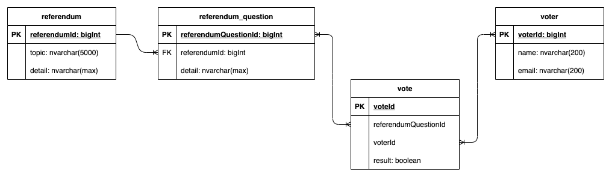

# APIGATE Technical Test

## Question1: Voting

Each voter can vote in zero or more referenda. Each referendum has one or more questions, and each question is a yes/no vote. Write the simplest normalized schema to describe this in generic SQL statements or as an entity-relationship diagram. Point out where the indexes would be if you want to quickly know the results of a given referendum question, but you never expect to query a single voter's voting record.

### **Answer Question1**

Entity diagram


* About index

Primary Key and Foreign Key as specific in the entity.

Logically would like to add contrainst for table `vote`, so that one voter should not vote on the same question

```
ALTER table vote
ADD CONSTRAINT uq_referendumQuestionId_voterId
UNIQUE (referendumQuestionId, voterId);
```

For index, probably add into table `vote` on column `referendumQuestionId` with the design question. <br>

However, rules of thumbs for design table index should depend on the usage and table size in order to avoid any overhead for other use-case, for example write operation.
Using explain query or sql profiler to analysize the query to give a better desgin.

```
CREATE INDEX idx_referenceQuestionId on vote(referendumQuestionId)
```

* Get result for a referendumQuestion

```
select 
 count(*) as voteCount,
 referendumQuestionId, 
 result
from vote where referendumQuestionId=`{$id}`
group by result
```

</br></br></br>

## Question2: Disk Management

Your client hosting their application on Linux based server. You received a critical alert from this server saying that the disk is full. What does that alert mean? What are the possible solutions to resolve this reported problem and when to use each of these solutions? For each solution, list down Linux based commands/tools you need to execute to achieve the solution.

### **Answer Question2**

[Answer Reference](https://www.cyberciti.biz/datacenter/linux-unix-bsd-osx-cannot-write-to-hard-disk/)

When the Disk is full on Unix-like system you get an error message on screen. In this example, I’m running fallocate command and my system run out of disk space:

```
$ fallocate -l 1G test4.img
fallocate: test4.img: fallocate failed: No space left on device
```

The first step is to run the df command to find out information about total space and available space on a file system including partitions:

```
df
```

OR try human readable output format:

```
df -h
```

* **Fixing problem when the disk is full**

    1. Compress uncompressed log and other files using gzip or bzip2 or tar command:

    ```
    gzip /ftpusers/tmp/*.log
    bzip2 /ftpusers/tmp/large.file.name
    ```

    2. Delete unwanted files using rm command on a Unix-like system:

    ```
    rm -rf /ftpusers/tmp/*.bmp
    ```

    3. Move files to other system or external hard disk using rsync command:

    ```
    rsync --remove-source-files -azv /ftpusers/tmp/*.mov /mnt/usbdisk/
    rsync --remove-source-files -azv /ftpusers/tmp/*.mov server2:/path/to/dest/dir/
    ```

    4. Find out the largest directories or files eating disk space on a Unix-like systesm:

    ```
    du -a /ftpusers/tmp | sort -n -r | head -n 10
    du -cks * | sort -rn | head
    # check for the whole disk #
    du -cks / | sort -rn | head
    ```

    5. Truncate a particular file. This is useful for log file:

    ```
    truncate -s 0 /ftpusers/ftp.upload.log
    ### bash/sh etc ##
    >/ftpusers/ftp.upload.log
    ## perl ##
    perl -e'truncate "filename", LENGTH'
    ```

    6. Find and remove large files that are open but have been deleted on Linux or Unix:

    ```
    ## Works on Linux/Unix/OSX/BSD etc ##
    lsof -nP | grep '(deleted)'

    ## Only works on Linux ##
    find /proc/*/fd -ls | grep  '(deleted)'
    ```

    To truncate it:

    ```
    ## works on Linux/Unix/BSD/OSX etc all ##
    > "/path/to/the/deleted/file.name"
    ## works on Linux only ##
    > "/proc/PID-HERE/fd/FD-HERE"
    ```

</br></br></br>

## Question3: Git

You're working on a cool branch of the foobar project, and your branch contains two commits A and B. The git lineage is:

```
X -- Y -- Z <-- master
           \
            A -- B <-- your-cool-branch
```

You want to contribute the code back to the master foobar repo, but you realize there is a really dumb typo in one of your source code comments in commit A. You'd still like to submit the pull request as two commits A' and B', where A' is the fixed version of A, and B' is the same exact diff as B. How do you rewrite git history to make this happen? Is B' the same hash as B? Why or why not?

### **Answer Question3**

Below is the step and command to change the comment in previous commit

```
git rebase -i HEAD~X
# X is the number of commits to go back
# Move to the line of your commit, change pick into reword,
# then change your commit message:
git commit --amend
# Finish the rebase with:
git rebase --continue
```

The commit hash for commit A' and B' will both be changed.

Git hashes are calculated using a number of items, including the author name/date, commit name/date commit message, tree, and parent SHA, among others. When you amend a commit, the commit name and date are updated. (You generally don't see the commit name and date unless you pass additional formatting options to git log.) Because that has been updated, the commit hash will change when a commit is amended.

</br></br></br>

## Question4: Unix tools

In one Unix command, find all of the files in /usr/local whose contents contain the word "aardvark" (case-insensitive), and list them all in order from most-recently created to least-recently created.

### **Answer Question4**

```
ls -tU /usr/local/ | xargs grep "aardvark"  -rni
```

Explain: </br>
list out the file and sort by created desc </br>
grep to find contents consist of `aardvark` with case insensitive

</br></br></br>

## Question5: Unix tools

State two reasons why below code is not considered a clean code. Propose one or more enhancements to mitigate the potential risks in this line of code.

```
 var hasMiddlenameProperty = customer.hasOwnProperty("middlename");
```

### **Answer Question5**

Proposed new method:

```
  const hasMiddlenameProperty = {}.hasOwnProperty.call(customer, "middlename")
```

Reason1:
`hasOwnProperty` is defined as a field in customer not as a function will return

```
    const customer = {
        "hasOwnProperty": "somethings"
    }
    const hasMiddlenameProperty = customer.hasOwnProperty("middlename");
    // Some error: TypeError: customer.hasOwnProperty is not a function
```

Reason2:
`customer` might be null or undefined

```
    const customer = null
    const hasMiddlenameProperty = customer.hasOwnProperty("middlename");
    //Some error: TypeError: Cannot read property 'hasOwnProperty' of null
```

</br></br></br>

## Question6: Unix tools

Explain how below code could introduce overheads and considered vulnerable for DoS attack? Re- write the below code to enhance and resolve the potential performance and security problems.

```
const http = require('http');
http.createServer(async (req, res) => { try {
  // Some app logic here
res.writeHead(200); res.end();
}
}).listen(3000);
```

### **Answer Question6**

A DOS attack really shouldn't be handled by HTTP server. Once a request has reached it the attacker has 'won' by taking up a connection (no matter how short). Even if they are short they can just slam it with thousands/sec and prevent anyone else from connecting. Also, they might not attempt to 'connect' via TCP and just flood the server with all sorts of requests.

Block/detect DOS attacks at a lower level or via a firewall, which I'm sure many software and hardware versions support some basic types of DOS detection and prevention.

But by looking at the code, there is few library that we can add in

1. import `cors`, which can control access from certain domain and request
2. import `helment`, which helps you secure your apps by setting various HTTP headers
3. import `rate-limiter-flexible`,  which can prevent the brute force and DOS attack

</br></br></br>

## Question7: Unix tools

Take a look at the following:

```
function *foo(x) {
  while (x < 4) {
    x += yield x;
}
return x; }
var bar = foo(3); 
console.log( bar.next(1) ); 
console.log( bar.next(1) );
console.log( bar.next(1) );
````

What is the output of this code snippet, and why does it behave in the way it does?

### **Answer Question7**

Output is

```
> { value: 3, done: false }
> { value: 4, done: true }
> { value: undefined, done: true }
```

`yield` keyword is used to resume or pause a generator function asynchronously. A generator function is just like a normal function but the difference is that whenever the function is returning any value, it does it with the help of `yield` keyword instead of return it. Yield can’t be called from nested functions or from callbacks.

The yield expression returns an object with two properties, “value” which is the actual value and “done” which is a boolean value, it returns true when generator function is full completed else it returns false.

If we pause the yield expression, the generator function will also get paused and resumes only when we call the next() method. When the next() method is encountered the function keeps on working until it faces another yield or returns expression.

For above case</br>
First call is fall into `yield` expression, which return value=3 and done=false
Second call is fall into return, which return value=4 and done=true
Third call is return value=undefined, and done=true remain as it is.

</br></br></br>
